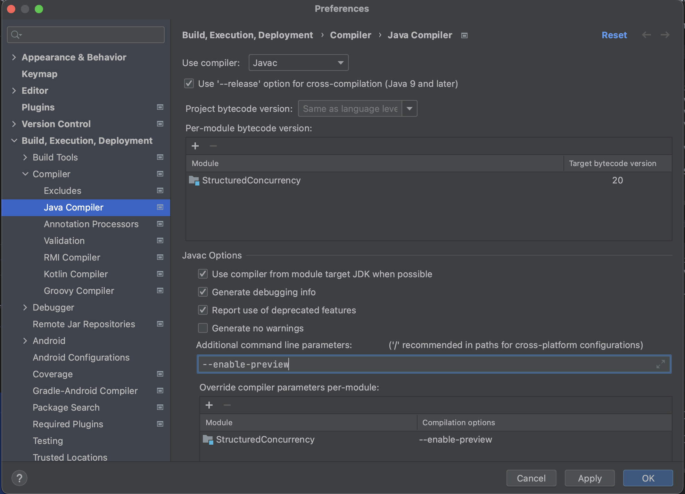
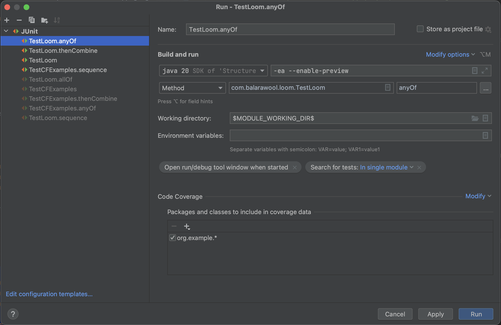

# CompletableFuture vs. Structured Concurrency

Some examples of async use-cases implemented using CompletableFuture and equivalent implementations using Structured Concurrency.
Structured concurrency will be available in future versions of Java (> 19).

> ### Note:
> If you want to run these examples, see the requirements at the bottom of this page.

## Example 1:
Sequence of tasks:

With ``CompletableFuture``:

    public static void sequence() {
        var future = CompletableFuture.supplyAsync(GamesUtil::getPlayer)
            .thenApply(GamesUtil.Player::performance)
            .thenApply(GamesUtil.Performance::scores)
            .thenApply(scores -> scores.stream().map(GamesUtil.Score::runs).filter(i -> i >= 100).count());
        System.out.println("Centuries: " + future.join());
    }

Equivalent code with structured concurrency is:

    public static void sequence() {
        var player = GamesUtil.getPlayer();
        var centuries = player.performance()
                .scores()
                .stream()
                .map(GamesUtil.Score::runs)
                .filter(i -> i >= 100)
                .count();
        System.out.println("Centuries: " + centuries);
    }

## Example 2:
Execute all sub tasks:

With ``CompletableFuture``:

    public static void allOf() {
        var future1 = CompletableFuture.supplyAsync(EventUtil::reserveVenue);
        var future2 = CompletableFuture.supplyAsync(EventUtil::bookHotel);
        var future3 = CompletableFuture.supplyAsync(EventUtil::buySupplies);

        var futureEvent = CompletableFuture.allOf(future1, future2, future3)
                .thenApply(ignored -> {
                    var venue = future1.join();
                    var hotel = future2.join();
                    var supplies = future3.join();

                    return new EventUtil.Event(venue, hotel, supplies);
                });

        System.out.println("Event : " + futureEvent.join());
    }

Equivalent code with structured concurrency is:

    public static void allOf() {
        try(var scope = new StructuredTaskScope.ShutdownOnFailure()) {
            var future1 = scope.fork(EventUtil::reserveVenue);
            var future2 = scope.fork(EventUtil::bookHotel);
            var future3 = scope.fork(EventUtil::buySupplies);

            scope.join();

            var venue = future1.resultNow();
            var hotel = future2.resultNow();
            var supplies = future3.resultNow();

            System.out.println("Event: " + new EventUtil.Event(venue, hotel, supplies));
        } catch (InterruptedException e) {
            throw new RuntimeException(e);
        }
    }

## Example 3:
Execute at least one sub task:

With ``CompletableFuture``:

    public static void anyOf() {
        var future1 = CompletableFuture.supplyAsync(() -> StockUtil.getPriceFromSource1("APPL"));
        var future2 = CompletableFuture.supplyAsync(() -> StockUtil.getPriceFromSource2("APPL"));
        var future3 = CompletableFuture.supplyAsync(() -> StockUtil.getPriceFromSource3("APPL"));

        CompletableFuture.anyOf(future1, future2, future3)
                .thenAccept(price -> System.out.println("Price: " + price))
                .join();
    }

And with structured concurrency:

    public static void anyOf() {
        try(var scope = new StructuredTaskScope.ShutdownOnSuccess<StockUtil.Price>()) {
            scope.fork(() -> StockUtil.getPriceFromSource1("APPL"));
            scope.fork(() -> StockUtil.getPriceFromSource2("APPL"));
            scope.fork(() -> StockUtil.getPriceFromSource3("APPL"));

            var price = scope.join().result(RuntimeException::new);

            System.out.println("Price: "+ price);
        } catch (InterruptedException e) {
            throw new RuntimeException(e);
        }
    }

## Example 4:
Combine multiple sub tasks:

With ``CompletableFuture``:

    public static void thenCombine() {
        var future1 = CompletableFuture.supplyAsync(CustomerUtil::getCurrentCustomer);
        var future2 = future1.thenApply(CustomerUtil::getSavingsData);
        var future3 = future1.thenApply(CustomerUtil::getLoansData);

        var future = future2.thenCombine(future3, (savings, loans) -> new CustomerDetails(savings, loans));

        System.out.println("Customer details: " + future.join());
    }

And with structured concurrency:

    public static void thenCombine() {
        var customer = CustomerUtil.getCurrentCustomer();

        try(var scope = new StructuredTaskScope.ShutdownOnFailure()) {
            var future2 = scope.fork(() -> CustomerUtil.getSavingsData(customer));
            var future3 = scope.fork(() -> CustomerUtil.getLoansData(customer));

            scope.join();

            var savings = future2.resultNow();
            var loans = future3.resultNow();

            System.out.println("Customer details: " + new CustomerUtil.CustomerDetails(savings, loans));
        } catch (InterruptedException e) {
            throw new RuntimeException(e);
        }
    }

## Pre-requisites:

- Project Loom early access build.
You would need get early access build with support for structured concurrency.
You can get one from here: https://jdk.java.net/loom/
These are builds based on JDK 20.

- Make sure you use ``--enable-preview`` for build and run.
If you are using IntelliJ:
    - Make sure to enable preview for Java Compiler:
  
  
    - Make sure to enbale preview in 'Run Configurations...'
  
  
